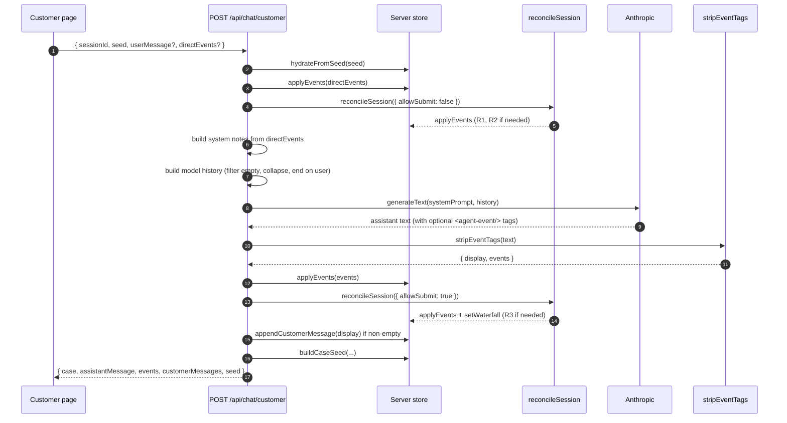

The architecture has one core idea: **the model is a narrator over a deterministic state machine, never the controller**.

If you take only one thing from this section, take that. Everything else (reconciliation, the event protocol, cold-start recovery, the empty-turn protection) is a consequence.

## The shape

```
┌─────────────────────────┐    ┌─────────────────────────┐
│  Customer surface       │    │  Installer surface      │
│  (phone)                │    │  (tablet)               │
│                         │    │                         │
│  - chat thread          │    │  - chat thread          │
│  - structured cards     │    │  - facts panel          │
└─────────┬───────────────┘    └─────────┬───────────────┘
          │                              │
          │  POST /api/chat/customer     │  POST /api/chat/installer
          │  POST /api/session/[id]/seed │
          ▼                              ▼
┌─────────────────────────────────────────────────────────┐
│  Server routes                                          │
│                                                         │
│  1. hydrateFromSeed(seed)            // recover state   │
│  2. applyEvents(directEvents)        // UI buttons      │
│  3. reconcileSession({allowSubmit})  // gate rules      │
│  4. generateText(systemPrompt, history)  // model call  │
│  5. parseAgentEvents(model output)   // extract events  │
│  6. applyEvents(events)              // model events    │
│  7. reconcileSession({allowSubmit})  // again, post-model│
│  8. return { case, transcript, seed }                  │
└─────────────────────────────────────────────────────────┘
                         │
                         ▼
              ┌─────────────────────┐
              │ Audit dashboard     │
              │ /audit/[sessionId]  │
              │                     │
              │ - timeline          │
              │ - replay engine     │
              └─────────────────────┘
```

### Turn-level sequence

The customer chat route is the single hottest path. One full request looks like this (mermaid source; renders as a sequence diagram with mermaid support, otherwise readable as code):



Two reconciliations bracket the model call: one read-only before, one submission-allowed after. That second pass is what runs the waterfall when every gate has been satisfied but the model never emitted `submit_application`. See [Reconciliation](/architecture/reconciliation/) for why.

## State as the source of truth

`CaseState` ([lib/types.ts](https://github.com/bgood11/lending-agent/blob/main/lib/types.ts)) is what the journey produces. Every meaningful thing that's happened lives there:

```ts
interface CaseState {
  sessionId: string;
  retailerName: string;
  status: "intake" | "awaiting_customer" | "customer_active" | "quote_ready"
        | "submitting" | "waterfall_running" | "awaiting_counter_decision"
        | "selected" | "declined" | "ineligible" | "withdrawn" | "complete";
  project: ProjectFacts;
  contact: CustomerContact;
  personal: PersonalFacts;
  financial: FinancialFacts;
  eligibility?: EligibilityFacts;
  provisionalQuote?: ProvisionalQuote;
  emailPreference?: EmailPreference;
  disclosures: DisclosureRecord[];
  consents: ConsentRecord[];
  waterfall?: WaterfallResult;
  selectedOfferId?: string;
  caseOutcome?: CaseOutcomeRecord;
  installerHandoffComplete: boolean;
  createdAt: string;
  updatedAt: string;
}
```

Every server route reads case state, mutates it through `applyEvents`, runs reconciliation, and returns the new state. The model's output is parsed for events but doesn't directly touch state.

## Two paths to mutation

State changes come from two places:

**Direct events from the UI.** Button clicks and form submissions emit `directEvents` in the request body to `/api/chat/customer`. These are deterministic. They run before the model is called. They're the source of truth for regulated commitments (eligibility answers, quote selection, consent grant/refuse, application details, vulnerability flag, withdraw).

**Model events.** The agent embeds `<agent-event type="..." data='...' />` tags in its prose. The parser strips them out and applies them. Used for things the model legitimately drives: greeting, narrative pacing, signposting which disclosure to present next.

Both paths flow through the same `applyEvents` function. See [Event protocol](/architecture/event-protocol/).

## Why the model is never alone

The agent's output is probabilistic. Sometimes it forgets to emit `acknowledge_disclosure` after a customer says "I understand". Sometimes it tries to restart from step 1 mid-journey because a retry filled the context with noise. Sometimes it produces a turn with only events and no prose.

If you let the model be the controller, any of these is a journey-breaking bug. By making it a narrator, none of them are. The deterministic side decides what's actually happened. The model just describes it.

This is the load-bearing design decision. See [Fail-safe state machine](/safety/fail-safe-state-machine/) for the safety implications.

## Reconciliation

The cross-cutting "if X has happened, also fire Y" rules live in one function: `reconcileSession()` in [lib/reconcile.ts](https://github.com/bgood11/lending-agent/blob/main/lib/reconcile.ts). Three rules:

1. If `credit_search` consent is granted but the `credit_search_consent` disclosure isn't acknowledged, acknowledge it.
2. If `credit_search` consent is granted but `pre_contract_summary` isn't yet presented, present it.
3. If pre-contract is acknowledged AND consent is granted AND personal+financial+quote are captured AND no waterfall has run yet, run the waterfall.

Every state-reading server route calls reconciliation at the top. See [Reconciliation](/architecture/reconciliation/).

## Stateless serverless

Vercel functions don't share memory across cold instances. The demo handles this with a URL-borne seed: every response includes a base64-encoded snapshot of the case state and transcript. The customer page carries it in the URL between calls. Cold instances hydrate from the seed first.

This is messy. In production you'd swap to Redis or a real database. The seed pattern continues to work as a recovery mechanism even when there's a primary store. See [Cold-start recovery](/architecture/cold-start-recovery/).

## Where the seams are

If you wanted to make this real, almost everything can stay. The mock surface is concentrated in **`lib/decision-engine.ts`**: the lender panel definition, the waterfall executor, the counter-offer logic. Every other file is structural.

See [Mock-vs-real boundary](/architecture/mock-vs-real/) for the full inventory.

## Files in priority order

If you're new to the codebase, read in this order:

1. [`lib/types.ts`](https://github.com/bgood11/lending-agent/blob/main/lib/types.ts): the shape of everything
2. [`lib/system-prompts.ts`](https://github.com/bgood11/lending-agent/blob/main/lib/system-prompts.ts): the model's instructions
3. [`lib/reconcile.ts`](https://github.com/bgood11/lending-agent/blob/main/lib/reconcile.ts): the centrepiece
4. [`app/api/chat/customer/route.ts`](https://github.com/bgood11/lending-agent/blob/main/app/api/chat/customer/route.ts): how a turn flows
5. [`lib/decision-engine.ts`](https://github.com/bgood11/lending-agent/blob/main/lib/decision-engine.ts): the only mock boundary
