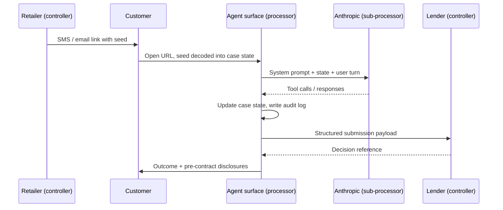

This page walks through a complete Lending Agent journey from the retailer hand-off to the lender submission, showing what data is collected at each gate, where it is stored, and which third parties see it. It is intended to support a privacy review and a Data Protection Impact Assessment (see [DPIA](./dpia)).

## High-level sequence

## Gate-by-gate data inventory

### Gate 0: Seed (retailer hand-off)

The retailer creates a customer link that carries a signed seed parameter in the URL. The seed contains the basket value, retailer reference, and a minimal customer identifier (typically first name and a hashed identifier). It does **not** carry full identity data, payment details, or any creditworthiness attributes. The signature prevents tampering and provides integrity for audit.

- **Data captured:** basket amount, retailer ID, short-lived nonce, optional given name.
- **Where it lives:** in the URL during the navigation, then decoded into in-memory case state once the customer surface mounts. The seed is not persisted to a cookie.
- **Privacy implication:** a URL is logged by intermediate proxies and by the user's browser history. The minimisation choice is to keep the seed limited and time-bound; see [data minimisation](./data-minimisation).

### Gate 1: Eligibility

The agent collects a small set of attributes needed to run a soft-search compatible eligibility check.

- **Data captured:** date of birth, residential status, employment status, gross annual income, postcode.
- **Where it lives:** structured fields on the in-memory case state, mirrored into the conversation state held server-side.
- **What flows to Anthropic:** the relevant turn of the transcript and the structured tool-call arguments. The agent does not send the customer name at this stage unless required.
- **What flows to the lender:** nothing yet. Eligibility is a broker-side gate.

### Gate 2: Quote

If eligibility passes, the agent quotes indicative APRs across the lender panel. No new personal data is collected, but a derived attribute (the indicative tier band) is added to the case state.

### Gate 3: Application details

The customer confirms full identity and address.

- **Data captured:** full name, current address, three-year address history, time at address, marital status, dependants, monthly housing cost, monthly outgoings.
- **Where it lives:** structured fields on the case state. The free-text turns of the conversation that produced these values are also retained as part of the transcript.
- **What flows to Anthropic:** turn-by-turn, the user message and a system view of the relevant case-state slice. The agent prompt design avoids re-sending unchanged personal data on every turn (a token-economy choice that is also a minimisation choice).

### Gate 4: Vulnerability

The agent offers an optional, plain-language vulnerability check aligned with the FCA's expectations under the Consumer Duty.

- **Data captured:** indicators rather than free-text disclosures. The customer can flag categories such as "recent bereavement", "long-term health condition", or "currently using a food bank" using closed options.
- **Where it lives:** indicator counts and category flags on the case state. Free-text elaborations, if the customer offers them, are kept on the transcript but not promoted to a structured field.
- **Special category status:** indicators that reveal physical or mental health are special category data under UK GDPR Article 9. See [UK GDPR](./uk-gdpr) for the conditions analysis.

### Gate 5: Consent

The customer is asked to provide explicit consent for a credit reference agency (CRA) search and for sharing the application with the chosen lender.

- **Data captured:** structured consent flags with timestamps, the consent text version, and the IP address used to consent.
- **Where it lives:** consent record in the case state; copied into the durable audit log.

### Gate 6: Pre-contract

The agent presents pre-contract credit information (PCCI) and the SECCI/Adequate Explanations required by CONC 4. No new customer data is collected, but the issued documents and timestamps are written to the audit log.

## Storage tiers

| Tier | Lifetime | Examples |
| --- | --- | --- |
| URL seed | Single navigation | Basket value, retailer ID |
| In-memory case state | Per session | Active gate data, derived bands |
| Server-side transcript | Session + short tail | User turns, assistant turns, tool calls |
| Durable audit log | Long retention | Decisions, consent records, PCCI hashes |
| Lender submission | Lender's own retention | Structured payload only |

## What flows where

- **To Anthropic (model sub-processor):** turn content, tool-call arguments and results, system prompt. Anthropic's commercial API does not train on this data and retains logs only for a short abuse-monitoring window. See [sub-processors](./sub-processors).
- **To the lender:** a structured submission payload only. The chat transcript is **not** sent. This is a deliberate minimisation: the lender needs the answers, not the conversation that produced them.
- **To the customer:** outcomes, decisions, PCCI documents, optionally a copy by email if they have requested one.
- **To the audit log:** decisions, gate transitions, hashed identifiers, consent timestamps. The log is designed to be replayable without re-exposing raw customer identifiers.

## A note on the replay endpoint

The agent has a deterministic replay endpoint used for debugging and for regulator inspection. It reconstructs a journey from the audit log without ever loading raw customer identifiers into the replayed view. Engineers see a redacted journey by default; raw fields require a separate, audited unseal step. This is treated as a privacy control and is recorded in the [DPIA](./dpia) mitigation register.
